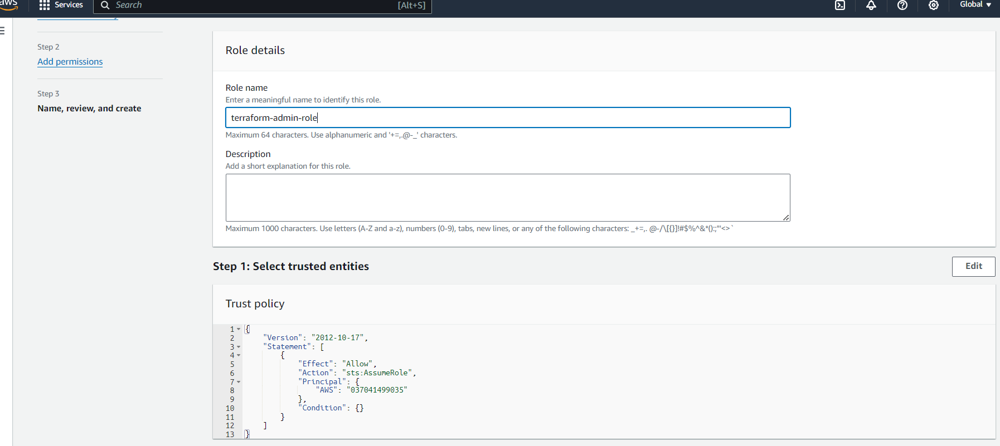
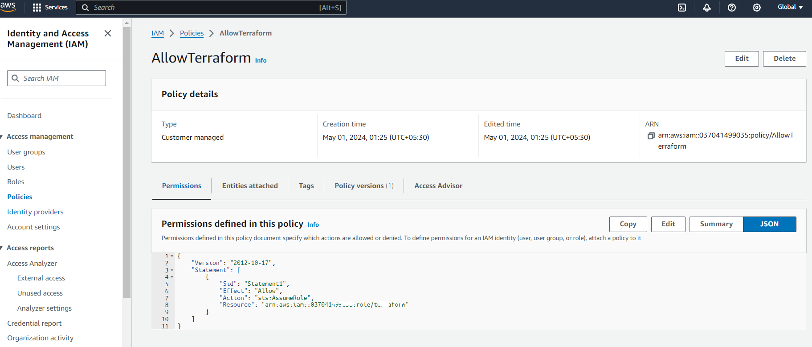
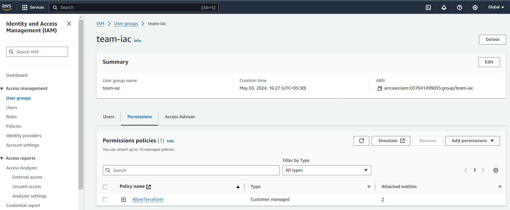
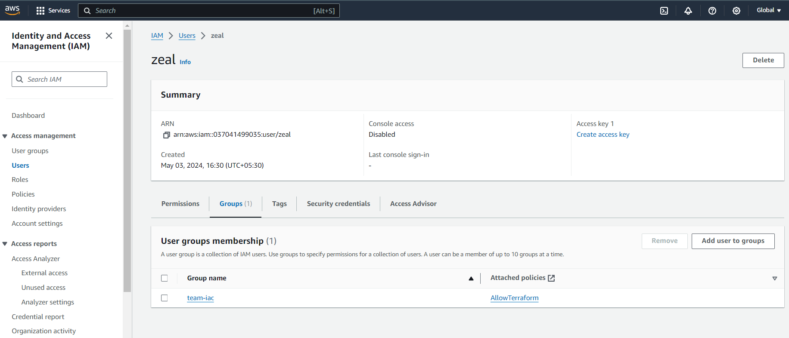
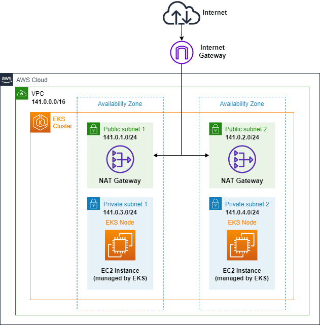

# EKS Setup that mimics the Production Grade Setup


# Overview

This project aims to automate the deployment of an Amazon Elastic Kubernetes Service (Amazon EKS) cluster within a Virtual Private Cloud (VPC) using Terraform. Amazon EKS provides a scalable and highly available platform for running Kubernetes workloads, 

By leveraging Terraform, this project streamlines the setup of the underlying AWS resources required for an EKS cluster, including `VPC networking components`, `security groups`, `IAM roles`, and the `EKS cluster` itself. With this automation, users can rapidly deploy and manage EKS clusters in a consistent and repeatable manner, reducing manual intervention and ensuring infrastructure consistency across environments.


# Prerequisites

Before deploying the infrastructure, ensure you have the following prerequisites:

1. **AWS Account**: You must have an AWS account with appropriate permissions to create and manage resources such as VPCs, EC2 instances, IAM roles, and EKS clusters.

2. **Terraform CLI**: Install the Terraform Command-Line Interface (CLI) on your local machine. You can download Terraform from the [official website](https://www.terraform.io/downloads.html) or use a package manager appropriate for your operating system.

3. **AWS CLI Configuration**: Configure the AWS CLI with appropriate credentials to interact with your AWS account. You can set up AWS CLI credentials using the `aws configure`.


# Folder Structure

This project consists of two separate Git repositories:

1. **infrastructure-modules**: This repository contains reusable Terraform modules for infrastructure components such as Amazon `EKS, VPC, Kubernetes-addons` and other resources. These modules encapsulate best practices and standard configurations for provisioning specific infrastructure resources.

   - `eks/`: Directory containing Terraform configurations and modules for setting up Amazon EKS clusters.
   - `vpc/`: Directory containing Terraform configurations and modules for creating Virtual Private Cloud (VPC) networks.
   - `Kubernetes-addons` : Directory containing Terraform configurations and modules for creating Kubernetes Addons like `Cluster Autoscaler`, `ArgoCD`.

   

2. **infrastructure-live**: This repository serves as the workspace for managing and deploying infrastructure using Terraform. It references and utilizes modules from the `infrastructure-modules` repository to provision infrastructure resources. I've separated the folder based on the environments like dev, staging, prod

   - `dev/`: Directory containing Terraform configurations specific to the development environment.
   - `staging/`: Directory containing Terraform configurations specific to the staging environment.
   - `prod/`: Directory containing Terraform configurations specific to the production environment.

   In the root of the infrastructure-live, there is a `terragrunt.hcl` file that would be used in each environments.
    
    **Within each environment directory:**
     - `terragrunt.hcl`: Terragrunt configuration file defining the Terraform configurations to be applied, including references to modules from the `infra-modules` repository.
     - `terraform.tfvars`: File for storing variable values specific to the environment (optional).
     - Other Terraform files and directories as needed for managing infrastructure.

    

The separation of `infrastructure-modules` and `infrastructure-live` repositories allows for modularity, reusability, and versioning of Terraform configurations. Changes to infrastructure modules can be made independently and propagated to different deployments managed in the `infrastructure-live` repository.


# AWS Configuration
#### Following the best practices, I've created:

- **Dedicaed IAM Role with Admin Acces (terraform).**
- **Policy from that role (AllowTerraform).**
- **User group (team-iac) and attached the policy (AllowTerraform).**
- **User (zeal) and added to user group (team-iac) which will automatically assume the role.**

IAM Role (terraform)


- Policy (AllowTerraform)


- User group (team-iac) .


- User (zeal) 


Once user is created and added to the group, I generated access keys (Access Key ID and Secret Access Key) for the IAM user  to authenticate programmatic access. Make sure that you have installed the `awc cli`.
- Open the terminal and set your profile 

```bash
aws configure --profile <profile_name>
```
As soon as you run this command, ou will be prompted to enter your `AWS Access Key ID`, `Secret Access Key`, `default region`, and `default output format`. Once you have provided the required information, AWS CLI will create a profile named profile_name in the AWS CLI configuration file (~/.aws/config on Unix-based systems or %USERPROFILE%\.aws\config on Windows).


# Terraform Backend Configuration
Using a remote backend, such as Amazon S3 and DynamoDB, offers several advantages over a local backend when managing Terraform state:

- Concurrency and Collaboration: 
Remote backends allow multiple users or automation processes to work on the same Terraform configuration concurrently without risking conflicts or corruption of the state file

- Durability and Availability:
Amazon S3 provides highly durable and available storage while DynamoDB offers a highly available and scalable database for state locking, ensuring that only one user or process can modify the state at a time.

- **Security:**
Storing state files remotely in a managed service like S3 allows you to apply granular access controls using AWS IAM policies. You can restrict access to the state files based on IAM roles, users, or groups, enhancing security.
DynamoDB provides built-in encryption at rest and integrates seamlessly with AWS IAM for access control.

- **Centralized Management:**
Using a remote backend centralizes the management of Terraform state files and locking mechanisms. You can configure and manage state storage and locking settings in a single location, making it easier to enforce consistency and compliance across environments.

- **Scalability:**
Remote backends like S3 and DynamoDB are designed to scale automatically to accommodate growing workloads and larger state files. This scalability ensures that Terraform can handle infrastructure deployments of any size or complexity.

- **Versioning and Auditing:**
With versioning enabled on the S3 bucket, you maintain a history of changes to the Terraform state files. This facilitates auditing, troubleshooting, and rollback of changes if necessary.


# AWS Resources 


## VPC: 
A Virtual Private Cloud (VPC) in AWS provides a logically isolated section of the AWS Cloud where you can launch AWS resources in a virtual network that you define. `EKS Cluster` will be created in this VPC and taht to in `private subnets` making it more secure.

   

- **IGW (Internet Gateway):** Internet Gateways enable communication between instances in your VPC and the internet, allowing resources within public subnets to connect to the internet.

- **Subnets:** Subnets are segmented networks within a VPC, allowing you to partition your VPC's IP address range into multiple sub-ranges to distribute resources across different availability zones.

- **NAT Gateway:** Network Address Translation (NAT) Gateway provides outbound internet access for instances in private subnets, allowing them to initiate outbound connections to the internet while remaining private.

- **Elastic IP:** Elastic IP addresses are static IPv4 addresses designed for dynamic cloud computing. They are associated with your AWS account, allowing you to mask the failure of an instance or software by rapidly remapping the address to another instance.

- **Route Tables:** Route Tables define the rules for routing traffic within a VPC. They determine how traffic is directed between subnets, internet gateways, virtual private gateways, and NAT gateways.


## EKS:
Amazon EKS is a managed Kubernetes service that makes it easy to deploy, manage, and scale containerized applications using Kubernetes on AWS.

- Provides a highly available and secure Kubernetes control plane managed by AWS.

- Integrates with AWS services such as Elastic Load Balancing, Identity and Access Management (IAM), and AWS CloudTrail.

- Allows you to run Kubernetes applications on AWS without needing to install, operate, and maintain your own Kubernetes control plane.

- Enables seamless integration with AWS features such as Auto Scaling Groups, AWS IAM roles for service accounts (IRSA), and Amazon CloudWatch for monitoring and logging.

