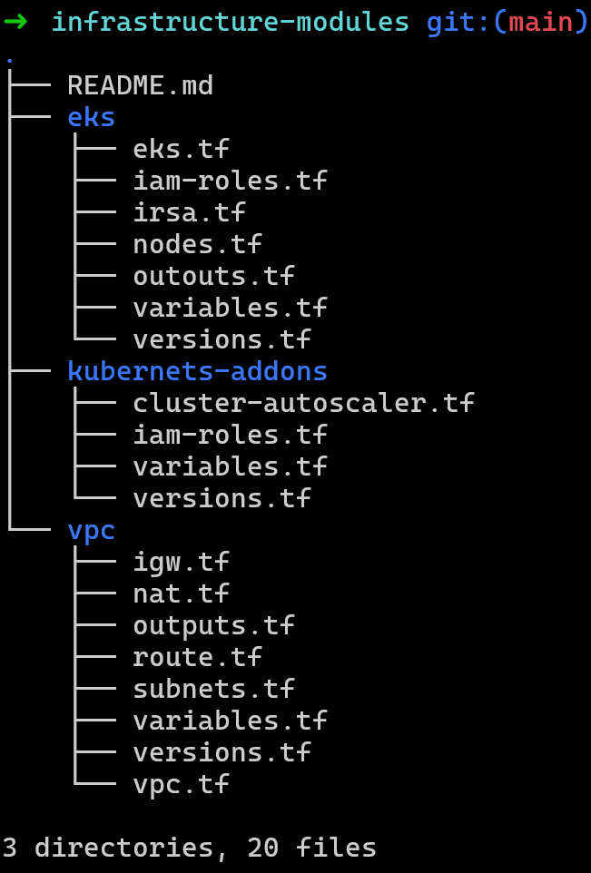
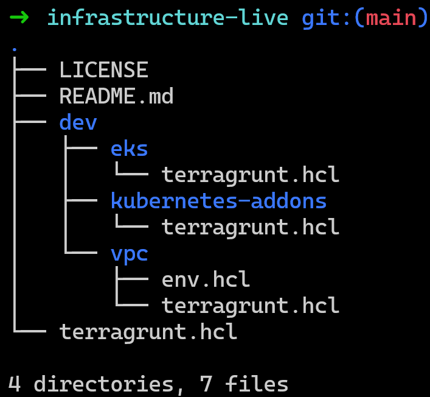

# EKS Setup that mimics the Production Grade Setup

# Overview

This project aims to automate the deployment of an Amazon Elastic Kubernetes Service (Amazon EKS) cluster within a Virtual Private Cloud (VPC) using Terraform. Amazon EKS provides a scalable and highly available platform for running Kubernetes workloads, 

By leveraging Terraform, this project streamlines the setup of the underlying AWS resources required for an EKS cluster, including `VPC networking components`, `security groups`, `IAM roles`, and the `EKS cluster` itself. With this automation, users can rapidly deploy and manage EKS clusters in a consistent and repeatable manner, reducing manual intervention and ensuring infrastructure consistency across environments.

# Prerequisites

Before deploying the infrastructure, ensure you have the following prerequisites:

1. **AWS Account**: You must have an AWS account with appropriate permissions to create and manage resources such as VPCs, EC2 instances, IAM roles, and EKS clusters.

2. **Terraform CLI**: Install the Terraform Command-Line Interface (CLI) on your local machine. You can download Terraform from the [official website](https://www.terraform.io/downloads.html) or use a package manager appropriate for your operating system.

3. **AWS CLI Configuration**: Configure the AWS CLI with appropriate credentials to interact with your AWS account. You can set up AWS CLI credentials using the `aws configure`.

# Folder Structure

This project consists of two separate Git repositories:

1. **infrastructure-modules**: This repository contains reusable Terraform modules for infrastructure components such as Amazon `EKS, VPC, Kubernetes-addons` and other resources. These modules encapsulate best practices and standard configurations for provisioning specific infrastructure resources.

   - `eks/`: Directory containing Terraform configurations and modules for setting up Amazon EKS clusters.
   - `vpc/`: Directory containing Terraform configurations and modules for creating Virtual Private Cloud (VPC) networks.
   - `Kubernetes-addons` : Directory containing Terraform configurations and modules for creating Kubernetes Addons like `Cluster Autoscaler`, `ArgoCD`.

   

2. **infrastructure-live**: This repository serves as the workspace for managing and deploying infrastructure using Terraform. It references and utilizes modules from the `infrastructure-modules` repository to provision infrastructure resources. I've separated the folder based on the environments like dev, staging, prod

   - `dev/`: Directory containing Terraform configurations specific to the development environment.
   - `staging/`: Directory containing Terraform configurations specific to the staging environment.
   - `prod/`: Directory containing Terraform configurations specific to the production environment.
    - Within each environment directory:
     - `terragrunt.hcl`: Terragrunt configuration file defining the Terraform configurations to be applied, including references to modules from the `infra-modules` repository.
     - `terraform.tfvars`: File for storing variable values specific to the environment (optional).
     - Other Terraform files and directories as needed for managing infrastructure.

    
    
The separation of `infrastructure-modules` and `infrastructure-live` repositories allows for modularity, reusability, and versioning of Terraform configurations. Changes to infrastructure modules can be made independently and propagated to different deployments managed in the `infrastructure-live` repository.
